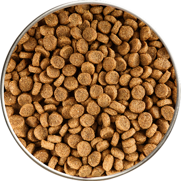
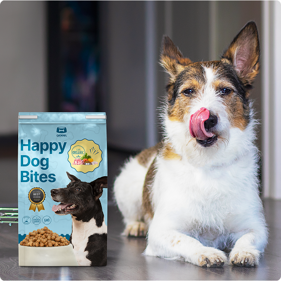

## Code implementation breakdown

## Overview of the Code
This is a product page for pet food. The page highlights the benefits of the product, includes a call-to-action button, and visually presents key selling points using a structured layout.

### 1. Structure of the Page
The page consists of multiple sections:
- Header Section: Displays the core selling points with icons.
- Middle Section: Includes a circular product image with overlapping elements.
- Call-to-Action (CTA): A button encouraging users to purchase.
- Guarantee & Payment Methods: Shows money-back guarantee and accepted payment options.
- Nutritional Information Section: Provides statistics and key benefits of the dog food.
- Bottom Section: Includes an image of dogs eating.

---

## Detailed Breakdown of Each Section

### 1. Head Section
```html
<head>
    <meta charset="UTF-8" />
    <meta name="viewport" content="width=device-width, initial-scale=1.0" />
    <title>Product Page</title>
    <script src="https://cdn.tailwindcss.com"></script>
</head>
```
- Sets the character encoding (`UTF-8`).
- Enables responsive design with `viewport`.
- Loads Tailwind CSS via a CDN for styling.

---

### 2. Header Section (Product Features)
```html
<div class="max-w-5xl mx-auto text-center py-8 px-6">
    <div class="grid md:grid-cols-3 items-center relative">
```
- The outer `div` centers the content with a max width of `5xl` (80rem).
- A grid layout (`md:grid-cols-3`) is used, splitting it into three columns on larger screens.
- It contains three groups of product benefits, each with an icon and description.

#### Example of a Feature Block
```html
<div class="flex items-center gap-4 p-4">
    <div class="w-20 h-20 lg:w-12 lg:h-12 p-3 rounded-full bg-green-200 flex justify-center items-center">
        
    </div>
    <div class="w-[75%]">
        <h3 class="text-lg font-bold text-gray-800">Real Food</h3>
        <p class="text-gray-600 text-[.9rem]">
            Wholesome recipes for dogs made with real meat and veggies.
        </p>
    </div>
</div>
```
- This flexbox layout arranges the icon (``) and text in a row.
- The `bg-green-200` class gives a green background to the icon container.
- The text is aligned in a left-aligned format.

Similar blocks are repeated for other features like Premium Ingredients, Made Fresh, and Vet Developed.

---

### 3. Middle Section (Circular Product Image)
```html
<div class="relative w-60 h-60 flex items-center justify-center">
    
    <div class="absolute w-1/2 h-full overflow-hidden left-0">
        
    </div>
    <div class="absolute w-0.5 h-full bg-red-500 left-1/2 transform -translate-x-1/2"></div>
    <div class="absolute w-6 h-6 bg-white rounded-full flex items-center justify-center border border-gray-300 left-1/2 top-1/2 transform -translate-x-1/2 -translate-y-1/2">
        <span class="text-red-500 text-[.6rem] text-center"> < ></span>
    </div>
</div>
```
- This section contains a circular image representing the dog food.
- A half-circle overlay is positioned on the left (`absolute` positioning).
- A red dividing line runs vertically through the center.
- A small center circle with `"< >"` adds emphasis to the middle.

---

### 4. Call-To-Action (CTA) Button
```html
<button class="bg-orange-500 text-white px-8 py-3 rounded-lg text-lg font-semibold shadow-md hover:bg-orange-600 transition">
    Get your dog’s healthy meal today!
</button>
```
- Orange button (`bg-orange-500`) to attract attention.
- Has a `hover:bg-orange-600` effect for a smooth transition.

---

### 5. Payment Methods & Money-Back Guarantee
```html
<div class="flex items-center gap-4 text-gray-600 text-sm mt-2">
    <div class="flex items-center gap-2">
        
        <span>30-day money-back guarantee</span>
    </div>
    <div class="flex items-center gap-2">
        
        
        
        
        
    </div>
</div>
```
- Includes a guarantee badge (`shield-checkmark`).
- Lists supported payment options (PayPal, Visa, MasterCard, Apple Pay, Google Pay).

---

### 6. Nutrition Information Section
```html
<section class="bg-gray-200 w-full">
    <div class="max-w-5xl mx-auto text-center py-10 px-6">
        <div class="grid md:grid-cols-2 gap-8 items-center">
            <div class="h-full flex flex-col justify-between text-left">
                <h3 class="text-3xl font-bold text-gray-800 mb-[-1.2rem]">
                    Nutrition is the foundation for longer, healthier lives in dogs.
                </h3>
                <p class="mt-4 text-gray-800">
                    Invest in your dog's future with our scientifically formulated superfood-powered supplements.
                </p>
                <div class="mt-4 space-y-2 text-gray-700">
                    <div class="flex justify-between gap-6">
                        <h1 class="text-red-500 text-[1.6rem] font-bold">97%</h1>
                        <p class="text-[.9rem]">Dogs choose our dog food over leading brands...</p>
                    </div>
                    <div class="flex justify-between gap-6">
                        <h1 class="text-red-500 text-[1.6rem] font-bold">84%</h1>
                        <p class="text-[.9rem]">Our dog food provides superior nutrition...</p>
                    </div>
                    <div class="flex justify-between gap-6">
                        <h1 class="text-red-500 text-[1.6rem] font-bold">92%</h1>
                        <p class="text-[.9rem]">Our dog food's high protein and fat digestibility...</p>
                    </div>
                </div>
            </div>
            <div class="w-full flex justify-center">
                
            </div>
        </div>
    </div>
</section>
```
- Left side: Displays nutritional statistics in a flexbox layout.
- Right side: Shows an image of a dog with food.

---

## Conclusion
- The page is well-structured with Tailwind CSS for styling.
- Uses grid and flexbox for layout.
- Encourages user interaction through buttons and icons.
- Responsive Design: Adjusts based on screen size.
